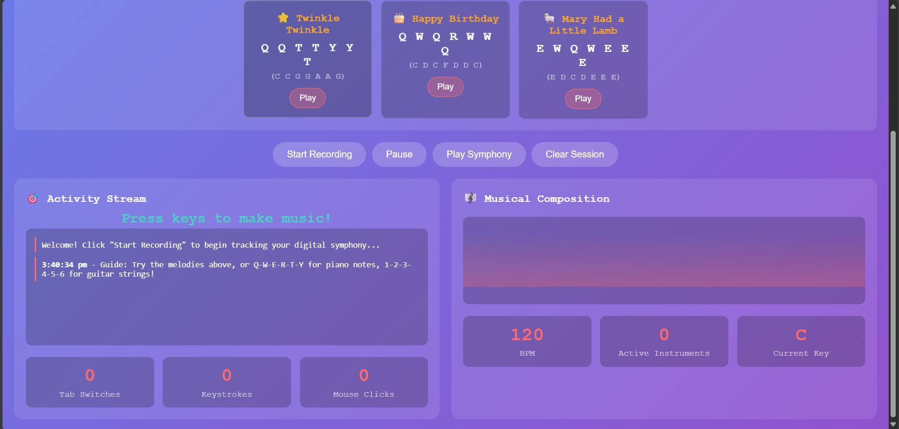

# Procrastination Symphony 🎯
https://procrastination-symphony.vercel.app/
## Basic Details
**Team Name:** SRUTHI G S

### Team Members
- **Team Lead & Member:** SRUTHI G S - Sree Buddha College of Engineering Pattoor


## Project Description
A web application that transforms your digital procrastination habits into beautiful, real-time music compositions. Every keystroke, mouse click, and tab switch becomes a note in your personal "Procrastination Symphony" - turning mindless browsing into an artistic masterpiece!

## The Problem (that doesn't exist)
Ever felt guilty about procrastinating online? Worried that your endless tab-switching and mindless scrolling serves no greater purpose? Concerned that your digital wandering lacks artistic merit and musical sophistication?

## The Solution (that nobody asked for)
Introducing Procrastination Symphony - the world's first guilt-free procrastination tool! Now every moment of digital distraction becomes a beautiful musical composition. Tab switches trigger guitar chord progressions inspired by "Soldier, Poet, King", keystrokes create fingerpicking melodies, and mouse clicks add magical sparkles to your personal symphony. Finally, procrastination with purpose!

## Technical Details

### Technologies/Components Used

#### For Software:
- **Languages used:** HTML5, CSS3, JavaScript (ES6+)
- **Frameworks used:** Vanilla JavaScript (no frameworks needed!)
- **Libraries used:** Web Audio API, DOM Manipulation
- **Tools used:** Modern web browser with audio support

#### Musical Components:
- **Audio Engine:** Web Audio API with real-time synthesis
- **Musical Scale:** Celtic/Modal progressions inspired by "Soldier, Poet, King"
- **Instruments:** Simulated guitar fingerpicking, magical sparkles, bass notes
- **Chord Progressions:** Eb-Ab-Fm-Cm (with capo simulation)

## Implementation

#### For Software:

##### Installation
```bash
# No installation required! Just download and open in browser
# Or serve locally with any web server:
python -m http.server 8000
# OR
npx serve .
```

##### Run
```bash
# Open the HTML file in any modern web browser
# Chrome, Firefox, Safari, Edge all supported
# Make sure to allow audio permissions when prompted
open procrastination-symphony.html
```

## Project Documentation

#### For Software:

##### Screenshots (Add at least 3)


#### Musical Features:

##### How It Works
- **Tab Switches** → Guitar chord progressions (Eb-Ab-Fm-Cm sequence)
- **Keystrokes** → Fingerpicking melody notes mapped to Celtic scale
- **Mouse Clicks** → Magical sparkle notes from higher frequencies
- **Scrolling** → Flowing arpeggios across the musical scale
- **Playback** → Complete symphony replay of your session

## Project Demo

### Video
<video controls src="WhatsApp Video 2025-08-02 at 15.21.25_c43bf193.mp4" title=""></video>

### Additional Demos
**Try these activities to hear your symphony:**
1. **Type a message** - Each letter creates fingerpicking guitar notes
2. **Switch between tabs** - Triggers full chord progressions  
3. **Click around the interface** - Adds magical sparkle effects
4. **Scroll up and down** - Creates flowing musical arpeggios
5. **Hit "Play Symphony"** - Replay your entire session as a musical composition

**Easter Eggs:**
- Typing vowels (a,e,i,o,u) creates melody notes
- Typing consonants creates bass and rhythm notes  
- Different websites trigger different chord progressions
- The musical key changes based on your activity patterns!

---
Made with ❤️ at TinkerHub Useless Projects

 